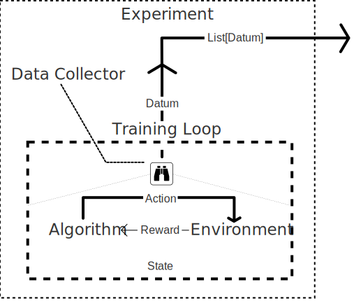

Code for paper "(Im-)Possibilities of Reward Poisoning Attacks on Reinforcement Learning"
==============================================================

[](https://github.com/aguilarjose11/AttackableMDP/actions/workflows/run_py_execution.yaml)

## Table of contents
| Sections                                                  |
|:----------------------------------------------------------|
| [Description](#description)                               |
| [Author Contact Information](#author-contact-information) |
| [Experiment Documentation](#experiment-documentation)     |
| [Code Setup Documentation](#code-setup-documentation)     |
| [Code Usage](#script-usage)                               |
| [Experiment API](#experiment-api)                         |
| [Implemented Algorithms](#implemented-algorithms)         |

Description
-----------

This code database implements the experiments discussed in our paper. We
conduct the experiments shown in the table bellow. For more 
information on how to run the experiments for each of these 
experiments, see the dedicated sub-section for each experiment. 

|                                  Experiment | Description                                                                                                      |
|--------------------------------------------:|:-----------------------------------------------------------------------------------------------------------------|
|   [**Cautious Decider**](#cautious-decider) | LSVI-UCB & Q-Learning solve a difficulty-variant MDP                                                             |
|            [**Half-cheeta**](#half-cheetah) | (DRL) PPO & DQN solve MuJoCo simulation. Objective: Demonstrate characterization amid 2-policy settings          |
| [**Inverted Pendulum**](#inverted-pendulum) | (DRL) PPO & DQN solve MuJoCo simulation. Objective: Demonstrate characterization amid multi-policy settings<br/> |

---

Author Contact Information
-----------------

|                            Name                            | Contact Info                                                |
|:----------------------------------------------------------:|:------------------------------------------------------------|
| Jose E. Aguilar Escamilla - [Website](https://aguilar.phd) | [aguijose@oregonstate.edu](mailto:aguijose@oregonstate.edu) |

---

Experiment Documentation
------------------------

### Cautious Decider

### Half-Cheetah

### Inverted Pendulum

---

Code Setup Documentation
-------------------------

### Libraries (>= Python 3.12.4)

For more information on the version specifics, see the [`environment.
yaml`](./environment.yaml) file. To import the environment, execute the 
following command prompt commands:

```bash
[mamba | conda | microbamba] create -n env python=3.12
[mamba | conda | microbamba] activate env
[mamba | conda | microbamba | pip] install numpy scipy pandas seaborn matplotlib jupyter gymnasium pytest

conda install pytorch torchvision torchaudio pytorch-cuda=12.1 -c pytorch -c nvidia
```
For the last step, we strongly recommend to 
[Follow Nvidia tutorial to install pytorch](https://pytorch.org/get-started/locally/)
. The code we provide to install pytorch is the one used for our 
project.


- Seaborn
- Matplotlib
- Jupyter
- scipy
- numpy
- pandas
- pytorch (see [Pytorch installation website](https://pytorch.org/get-started/locally/))
- Gymnasium by Farama (previously OpenAI gym)
- pytest (testing included)


---

Script Usage
------------------

Our experiments are run using our own experiment training pipeline.
The main file with which our results can be duplicated is ``run.py``.
This file contains a CLI menu from which the specific experiment to be
executed is selected. The following flags are part of the CLI menu:

### Training Pipeline


| Flag (Experiments)      | Description                             |
|-------------------------|-----------------------------------------|
| ``--cautious_decider``  | [Cautious Decider](#cautious-decider)   |
| ``--half_cheetah``      | [Half-Cheetah](#half-cheetah)           |
| ``--pendulum``          | [Inverted Pendulum](#inverted-pendulum) |
| ``--config [file.cfg]`` | Experiment-specific configuration.      |

| Flag (Hyperparameters)     | Description                                                                                                                              |
|----------------------------|------------------------------------------------------------------------------------------------------------------------------------------|
| ``--epochs [number]``      | Number of epochs to train on.                                                                                                            |
| ``--output [folder name]`` | Output folder into which data and models will provided. If ``<date>`` is included in name, today's date will be replaced in folder name. |
| ``--debug``                | Flag indicating that no data will be outputed and only one epoch will be executed.                                                       |

Example of experiment call:

```bash
python3 src/paper_experiments/run.py --[experiment] --epochs [epochs] --output [folder] 
--config file      
```

The rest of every experiment configuration can be found within the 
configuration file passed. See our given [configuration files](./config_files) 
for our experiments to see how the experiments were configured. We 
provide an extra help flag to see a description: `--experiment_help`. 
To use this flag you must select an experiment as well. No experiments 
will be run if this flag is used.

### File Structure


We follow a classic [pip project structure](https://packaging.python.org/en/latest/tutorials/packaging-projects/).
In the `src/` folder you can find our paper_experiments package where 
`run.py` and other requirements are located.

---

---

Experiment API
==============
In order for experiments to be centralized and modular, we have
developed an experiment API to register and
execute experiments and collect data. This pipeline can also be reused
for other projects, and we encourage anybody who sees use to use this.

```
src/paper_experiments/experiments/
├── __init__.py
├── algorithm.py
├── base.py
├── data_collector.py
├── environment.py
├── experiment.py
└── loop.py
```
The structure of the API library, as depicted above, organizes the 
code into the five core parts of an experiment.

| Topics                                      |
|---------------------------------------------|
| [Basic Concepts](#basic-concepts)           |
| [Class/API Structure](#classes-and-objects) |
| Creating and Running an Experiment          |
| Creating a New Algorithm                    |
| Creating a New Environment                  |

Basic Concepts
--------------

The core principles on which our pipeline rests are the following:
1. [Modularity of Code](#first-pilar-modularity)
2. [Code Reuse](#second-pilar-code-reuse)
3. [Simplicity](#third-pilar-simplicity)

### First Pilar: Modularity
The first pilar of our pipeline is **Code Modularity**. Specifically, we
strive to create an experiment API that allows separate implementation
of environments, algorithms, data collectors, and training loops. As 
many AI researchers may attest, in particular in theoretical AI, it is
rather difficult to find or implement some of the algorithms and 
environments for our research. Often, this is a result of a lack of open
source code in published work.

### Second Pilar: Code Reuse
Further, during the career of an AI scientist, it is common to compare
different algorithms and environments to investigate the performance of 
algorithms on different problem settings. It is often a waste of time 
when scientists have to spend time "re-fitting" their code to work over
different algorithms and environments. To address this problem, we 
believe that learning and using this API will decrease the time spent in
"re-connecting" code as well as limiting the amount of time needed. 

We hope that our API _will provide the same ease of implementation of RL_
_experiments as most modern ML libraries do_. Because reinforcement 
learning experiments are intrinscically different than machine learning
ones, we have decided to sway away from common practice of machine 
learning APIs and use the naturally-interactive definition of an RL
problem. This is evident when looking at the similarities of the API 
architecture and the RL problem definition 
(see [Classes and Objects](#classes-and-objects)).

### Third Pilar: Simplicity
We aim at creating a pythonic API that allows the creation of new 
environments and algorithms in a simplified manner. We hope that the 
work put into the API will facilitate the development of new experiments
in a faster way without needing to understand the inner workings of the 
API. For this reason, we focus on simply presenting how to apply the API
to your use case without bothering on the inner workings of the API. If
you find this part of our API interesting or wish to contribute to this 
project, we will soon release documentation on it. Thus far, we strive 
in maintining well documented code, so reading our API code is a good 
start.

---

Classes and Objects
-------------------
The objective of our API is to provide the code needed to interconect 
the different parts that make up an experiment. Namely,

<p align="center">
  
</p>

Each of these abstract parts have unique abstract python classes that 
allow the API to connect all of these moving parts. For the rest of this
section will present the life process of an experiment as well as 
insepcting each of the parts that conform an experiment as presented in 
the above figure. Code examples will be given in the next section.

### Life Cycle of an Experiment

As we mentioned earlier, we model our API using the Reinforcement 
Learning problem definition as close as possible. The intended modus 
operandi involves simulating the interaction between Algorithms and 
Environments via States, Actions, and Rewards. This 
interaction is controlled by the **training loop** which prompts an 
**environment** for a **state**. Then, after giving the **state** to the 
**algorithm**, an **action** chosen by the **algorithm** is given back to the 
**environment**, changing it. In turn, the **environment** gives back a 
**reward** and a new **state**. This completes a single loop in the 
**training loop**. It is expected that the algorithm will learn from 
this interaction.

At each loop, a **Data Collector** will observe the products of this 
interaction, perform some computations, and collect this as a 
**Datum**. The Datum is intended to be a data type defined by the 
user that contains the data that the user wishes to collect. This datum
is also handled by the **Experiment**, which takes actions on the 
training loop if needed (e.g. early stop,) and provides as output a 
list of data.

#### Pseudo-code
```pseudocode
========================================================================
ALGORITHM - ONLINE REINFORCEMENT LEARNING (ORL) EXPERIMENT
========================================================================
INPUT: Env: Environment, 
       Alg: Algorithm, 
       DC: DataCollector

PARAMETERS: Horizon: int

OUTPUT: data: list[Datum]
------------------------------------------------------------------------

data <= list()
state <= Env.reset() 

FOR loop UNTIL Horizon:
    # Inner loop implemented by TrainingLoop
    action               <= Alg.act(state)
    state_, reward, info <= Env.step(action)
    
    Alg.learn(state, action, reward, state_)
    
    datum <= DC.inspect(state, 
                        action, 
                        reward, 
                        state_, 
                        Alg.inspect(), 
                        info)
    data += datum
    
    <= ADDITIONAL LOGIC OF EXPERIMENT/TRAINING =>
```

### Environment, State, Action, Reward

The Environment abstract class defines the structure and interface with 
which the training loop will carry out the reinforcement learning 
interaction described before. The _State, Action, and Reward_ 
encapsulate the basic units of information being shared through the 
training interaction. The abstract definition of these classes is 
simple (or assumed as in the case of _Reward_ which is a float,) and 
their implementation is left to the developer to define depending on 
the environment/MDP they may be implementing.

```python
from abc import ABC, abstractmethod

# Reward assumed to be just a float value
Reward = float

class Action(ABC):
    '''Abstract class of Action'''
    pass

class State(ABC):
    '''Abstract class of State'''
    pass

class EnvInfo(ABC):
   '''Environment information data structure'''
   pass

class Environment(ABC):
    '''Abstract class of Environment
    Properties
    ==========
    current_state: State
        - The current state of the environment. Will be affected by 
        the step method.
        - For more advanced use, Setter/Getter can be overriden but 
        given by default.
    Methods
    =======
    step(Action): tuple[State, Reward]
        - Applies the passed action and returns the subsequent 
        State and Reward generated by the effect of the action in 
        the environment.
    reset: State
        - Resets the environment and return the initial state. 
    '''
    
    ##################
    ### Properties ###
    ##################
    
    @property
    def current_state(self) -> State:
        ''' Current state property
        Stored in self._state, the property tracks the current state 
        of the environment. Setter and Getters are provided but not 
        required to be used. For more advanced use, setter and 
        getters can be overloaded by using the same decorator.
        '''
        return self._state
    
    @current_state.setter
    def set_current_state(self,
                          state: State) -> None:
        '''Ibid'''
        self._state = state
    
    @current_state.getter
    def get_current_state(self) -> State:
        '''Ibid'''
        return self._state
        
    ###############
    ### Methods ###
    ###############
    
    @abstractmethod
    def step(self,
             action: Action) -> tuple[State, Reward, EnvInfo]:
        '''Apply action to environment'''
        pass

    @abstractmethod
    def reset(self) -> State:
        '''Reset environment'''
        pass
```

### Algorithm
The _Algorithm_ abstract class intended use is to encapsulate a 
learning algorithm and provide the methods with which I/O between 
the environment and the algorithm.

```python
from abc import ABC, abstractmethod
from typing import Any

class Algorithm(ABC):
    
    # Properties    
    @property
    def timestep(self):
        pass
    
    # Methods
    
    @abstractmethod
    def act(self,
            state: State) -> Action:
        '''Algorithm decision making'''
        pass
    
    @abstractmethod
    def learn(self) -> None:
        '''Learning algorithm implementation'''
        pass
    
    @abstractmethod
    def inspect(self) -> dict | Datum | Any:
        ''' Inspect algorithm for data'''
        pass

    def __call__(self, *args, **kwargs):
        return self.act(*args, **kwargs)
```

### Training Loop
The training loop can be thought of as the class that puts together 
the interaction between the algorithm and the environment. The loop 
takes charge of sending the interaction data to the correct place 
for training. The loop also implements additional logic to control 
the experiment.

```python
from abc import ABC, abstractmethod

class TrainingLoop(ABC):
    '''Training loop'''
    
    @abstractmethod
    def loop(self) -> Datum:
        '''Single training loop'''
        pass
```


### Data Collector and  Datum
The data collector has the principal responsibility of collecting 
and creating a Datum that will be used for.
1. Making decisions in the training loop.
2. Creating data from the experiment.

```python
from abc import ABC, abstractmethod

class Datum(ABC):
    '''Individual experiment datum'''
    pass

class DataCollector(ABC):
    ''' Experiment data collector'''
    @abstractmethod
    def inspect(self,
                **kwargs) -> Datum:
        ''' Collects and create datum from experiment '''
        pass
```

### Experiment and `List[Datum]`

The _Experiment_ class takes charge of the following:
1. Initialize environment and algorithm
2. Run training loop
3. Collect data from experiment

```python
from abc import ABC, abstractmethod

class Experiment(ABC):
    '''Reinforcement Learning experiment '''
    
    @abstractmethod
    def execute(self) -> list[Datum]:
        '''Run experiment'''
        pass

    def __call__(self, *args, **kwargs):
        return self.execute(*args, **kwargs)
```

---

Implemented Algorithms
======================
Bellow is a description and pseudo-code used to implement algorithms 
with the `experiment` API.

Risk-Aware Preference-baser Reinforcement Learning (RA-PbRL)
------------------------------------------------------------

RA-PbRL is a type of Policy-Iteration and "Confidence Bound" 
reinforcement learning algorithm designed for preference-based 
reinforcement learning while maximizing risk-awareness through 
Value-at-Risk penalties. The intuition behind the algorithm depends 
on the idea of confidence bounds. The algorithm begins by computing 
the confidence bound sets within which there is a 1-δ probability 
that the transition function ($\hat{P}_k$), reward function 
($\hat{r}_k (\cdot)$), and policies ($\pi$). The first two are 
computed by 
finding a center to the sets, and then using theoretical bounds to 
limit the set (see UCB algorithm in bandit theory.) As for the 
policy optimization, we optimize for two policies. We accomplish 
this by computing a policy confidence set that contains 
"almost-optimal" policies with a minor sub-optimality gap. Finally, 
the two "most exploratory" policies are chosen (choose most and 
least optimal policies in set.) 

```pseudocode
========================================================================
ALGORITHM - Risk Aware Preference-based Reinforcement Learning (RA-PbRL)
========================================================================
INPUT:      τ1:  list[tuple[State, Action, Reward]],
            τ2:  list[tuple[State, Action, Reward]],

PARAMETERS: K:   int - Number of episodes,
            H:   int - Horizon,
            S:   State - State space cardinality,
            A:   Action - Action space cardinality,
            δ:   float - Theoretical probabilistic guarantee (1-δ),
            n_k: Callable[[State, Action], int] - # times (s,a) visited
            
OUTPUT:     
------------------------------------------------------------------------
P_k   <= argmin_P |P[s, a] @ I[s, a]|^2
B^P_k <= {P'| |P_k|}

```

---

## Development Status **TODO**
- [x]  Implement Abstract base classes
- [ ] Implement Proposed PbRL Algorithm
- [ ] Implement HalfCheetah Environment & Package state/actions
- [ ] Implement TrainingLoop tying everything together
- [ ] Implement DataCollector for PbRL Experiment
- [ ] Implement Experiment to tie everything together.
- [ ] Final checks and prepare for main release.

---

<sup><i>Jose E. Aguilar Escamilla - Summer 2024 - AI Ph.D. @
Oregon State University - Corvallis, OR.</sup></i>

